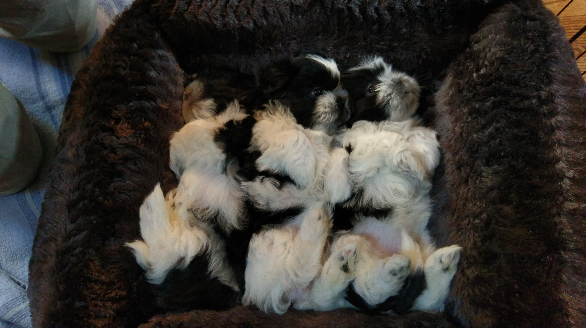

# oh hey I'm learning how to use github
## and markdown I guess 

All git commands have been done through terminal to relearn the Bash shell.  
This file was edited with Vim.  
**bold test**  
*italicized test*  

`sample line of code`  

There should be an image below of puppies.
---

